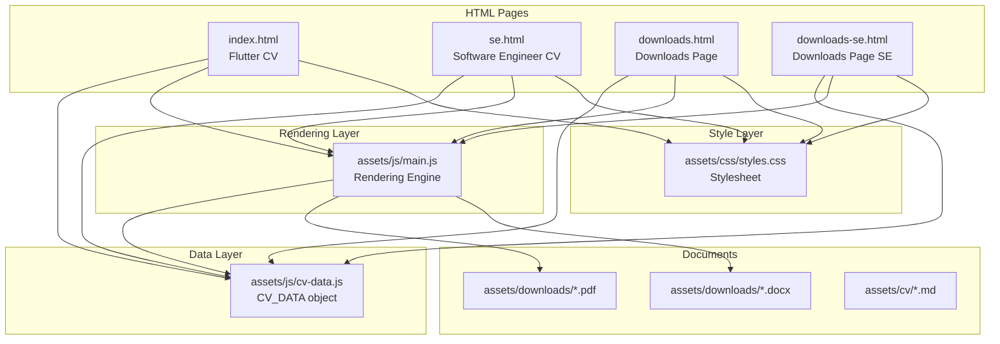
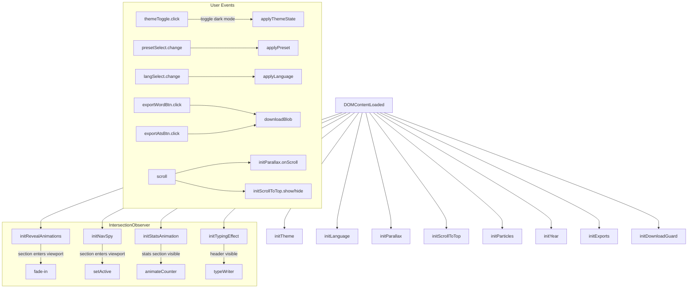
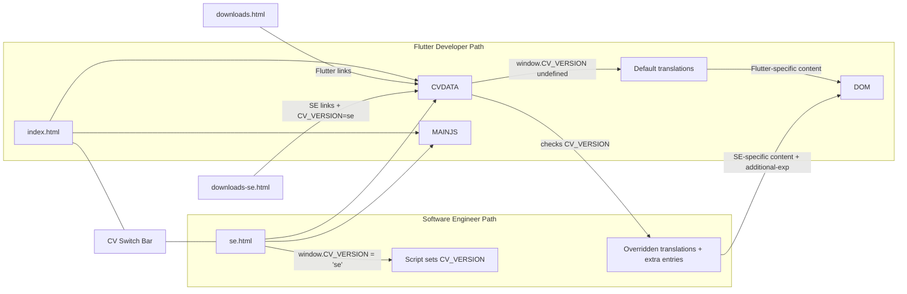

# Architecture — Mohamad Adib Tawil Online CV

## Complete Folder Structure

```
CV/
├── .claude/                          # Claude Code configuration
│   ├── launch.json                   # Launch config (serves on port 4200 via `npx serve`)
│   └── settings.local.json           # Permission rules for Claude Code
├── assets/
│   ├── css/
│   │   └── styles.css                # Main stylesheet (1184 lines)
│   ├── cv/                           # Plain text markdown CV content
│   │   ├── CV_Remote_EN.md
│   │   ├── CV_Remote_AR.md
│   │   ├── CV_Remote_EN_AR.md
│   │   ├── CV_Text_EN.md
│   │   ├── CV_Text_AR.md
│   │   └── CV_Text_EN_AR.md         # Bilingual plain text version
│   ├── downloads/                    # DOCX/PDF download files
│   │   └── .gitkeep                  # Empty; files added manually
│   └── js/
│       ├── cv-data.js                # Shared content data source (601 lines)
│       └── main.js                   # UI rendering, theming, interactions (1027 lines)
├── scripts/
│   └── generate_cv.js                # Node.js script for DOCX/PDF generation
├── .DS_Store                         # macOS metadata (ignore)
├── cv.md                             # Markdown version of CV content
├── downloads.html                    # Download/export page for Flutter CV
├── downloads-se.html                 # Download/export page for Software Engineer CV
├── index.html                        # Main page — Flutter Developer CV
├── se.html                           # Main page — Software Engineer CV
├── README.md                         # Project README
└── welcome_banner.svg                # Welcome banner graphic
```

## Responsibility of Every Major Folder

| Folder | Responsibility |
|--------|---------------|
| `assets/css/` | All visual styling via a single file `styles.css` |
| `assets/js/` | All JavaScript logic: CV data + UI rendering + theming + export |
| `assets/cv/` | Plain-text markdown copies of CV content for reference/download |
| `assets/downloads/` | Stores DOCX and PDF versions of CV (manually placed) |
| `scripts/` | Node.js CLI tool for generating DOCX/PDF from CV data |
| `.claude/` | IDE/agent configuration for Claude Code |

## Component Relationships



## Data Flow

```mermaid
flowchart LR
    CVDATA[cv-data.js<br/>CV_DATA Object] --> |DOMContentLoaded| MAINJS[main.js]
    MAINJS --> |getDict()<br/>selects language| DICT[Translation Dictionary]
    DICT --> |renderNav, renderHeader,<br/>renderSectionTitles, etc.| DOM[DOM Elements]
    CVDATA --> |stats[]| renderStats
    CVDATA --> |projects[]| renderProjects
    CVDATA --> |profile| renderHeader
    localStorage --> |theme, themePreset, lang| MAINJS
    MAINJS --> |applyThemeState, applyPreset, applyLanguage| localStorage
```

## Request Flow

Since this is a static website with no backend, there is no runtime API request flow. All data is embedded in `cv-data.js`. The only network requests are:

1. **Font Awesome CSS** — `cdnjs.cloudflare.com/ajax/libs/font-awesome/6.4.0/css/all.min.css`
2. **Google Fonts** — `fonts.googleapis.com` (Inter, Poppins, Tajawal)
3. **Avatars** — `avatars.githubusercontent.com`
4. **Project images** — `play-lh.googleusercontent.com`, `raw.githubusercontent.com`
5. **Download files** — `assets/downloads/*` (HEAD/GET fetch to check availability)
6. **Analytics** — `plausible.io/js/script.js`

## Event Flow



## Rendering Flow

```mermaid
flowchart TD
    START[Page Load] --> LOADCACHE[Read localStorage: theme, themePreset, lang]
    LOADCACHE --> READDATA[Load CV_DATA from cv-data.js]
    READDATA --> SELECTLANG[Select language dictionary via getDict()]
    SELECTLANG --> RENDERNAV[renderNav]
    SELECTLANG --> RENDERHEADER[renderHeader]
    SELECTLANG --> RENDERSECTIONS[renderSectionTitles]
    SELECTLANG --> RENDERCONTENT[renderContentSections]
    SELECTLANG --> RENDERFOOTER[renderFooter]
    SELECTLANG --> RENDERDOWNLOADS[renderDownloadsPage]
    RENDERCONTENT --> RENDERSTATS[renderStats]
    RENDERCONTENT --> RENDERPROJECTS[renderProjects]

    subgraph "Post-render"
        INITANIMATIONS[Init all animations]
        INITOBSERVERS[Init all IntersectionObservers]
    end

    RENDERPROJECTS --> INITANIMATIONS
    RENDERPROJECTS --> INITOBSERVERS
```

## CV Version Switching Architecture



The CV version is determined by `window.CV_VERSION` set in `<script>` tags in `se.html` and `downloads-se.html`. The `cv-data.js` file checks this variable and overrides translations with extended content including multiple experience entries, additional technical experience sections, and adjusted navigation.
