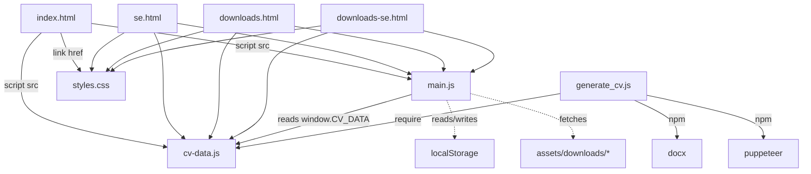
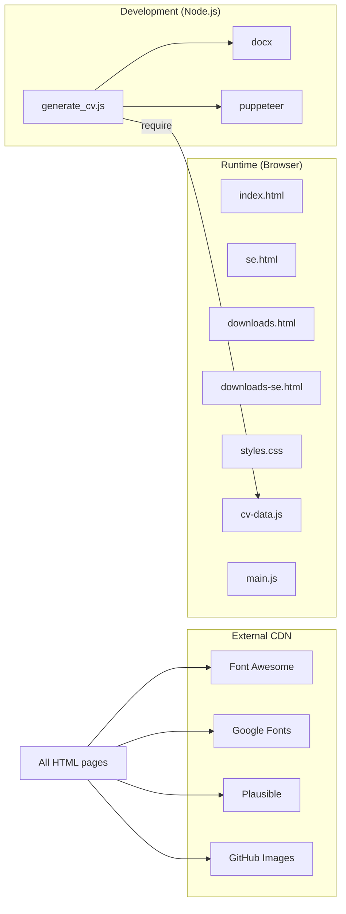

# Dependency Map — Mohamad Adib Tawil Online CV

---

## Internal Dependencies

### File-Level Dependency Graph



### Function-Level Dependency Chain (main.js)

```
DOMContentLoaded
├── initTheme()              # depends on: localStorage, applyThemeState(), applyPreset(), presetSelect element
├── initLanguage()           # depends on: localStorage, applyLanguage(), langSelect element
├── initRevealAnimations()  # depends on: IntersectionObserver, DOM sections
├── initNavSpy()            # depends on: IntersectionObserver, .top-nav a[href^='#'] elements
├── initParallax()          # depends on: window scroll event, header element
├── initScrollToTop()       # depends on: window scroll event, #scrollToTop element
├── initParticles()         # depends on: requestIdleCallback, #particles element
├── initStatsAnimation()    # depends on: IntersectionObserver, .stats-section
├── initYear()              # depends on: #currentYear element
├── initTypingEffect()      # depends on: IntersectionObserver, h1 element
├── initExports()           # depends on: #exportWordBtn, #exportATSBtn
├── initDownloadGuard()     # depends on: fetch API, all a[href*=downloads] elements
├── updateThemeColorMeta()  # depends on: meta[name='theme-color']
├── updateContrast()        # depends on: getComputedStyle
└── enableThemeTransition() # depends on: body element
```

### Data Shape Dependency (cv-data.js → main.js)

All render functions in `main.js` depend on the exact shape of `CV_DATA`:

```javascript
// CV_DATA contract — DO NOT MODIFY
{
  profile: { name, email, linkedinUrl, githubUrl, avatarUrl, hireMailSubject },
  downloads: {
    files: { en: { docx, pdf }, ar: { docx, pdf } },
    plainTextPath
  },
  stats: Array<{ icon, value, label: { en, ar } }>,
  projects: Array<{ id, name, tech[], image: { src, alt: { en, ar } }, description: { en, ar } }>,
  translations: {
    en: { nav, header, titles, footer, downloadsPage, summaryText, experienceRole, experienceList, skillsList, education, achievements, advancedSkills, services, languagesText },
    ar: { /* same shape */ }
  }
}
```

---

## External Dependencies

| Dependency | Type | Used By | Risk |
|-----------|------|---------|------|
| **Font Awesome 6.4.0** | CDN CSS | All HTML pages — icon library | **Low** — widely available CDN; local fallback via `fas` class names |
| **Google Fonts (Inter, Poppins, Tajawal)** | CDN CSS | All HTML pages — typography | **Medium** — if CDN fails, falls back to system fonts (`sans-serif`, `Arial`) |
| **Plausible Analytics** | CDN JS | `index.html`, `se.html` | **Low** — analytics only, non-blocking (`defer`) |
| **GitHub Avatar CDN** | Remote images | Profile picture | **Low** — image from `avatars.githubusercontent.com` |
| **GitHub/Google Play image CDNs** | Remote images | Project thumbnails | **Low** — images from multiple CDNs; `lazy` loading |
| **`docx` (npm)** | Node package | `scripts/generate_cv.js` | **Low** — dev-only tool, not in web pages |
| **`puppeteer` (npm)** | Node package | `scripts/generate_cv.js` | **Low** — dev-only tool, not in web pages |

---

## Dependency Risks

### High Risk
- **None** — The project has zero runtime package dependencies; all JS is vanilla.

### Medium Risk
- **Google Fonts CDN failure**: Arabic (`Tajawal`) and English (`Inter`) fonts would fall back. Arabic text may render less aesthetically without Tajawal. The JS explicitly sets font-family per language in `main.js:445-448`.
- **GitHub Avatar CDN failure**: Profile picture and project images would show broken image icons. All images have `alt` text.

### Low Risk
- **Font Awesome CDN failure**: Icons would not display but text remains readable.
- **Plausible analytics CDN failure**: No visible impact on users.

---

## Circular Dependency Warnings

**No circular dependencies detected.**

The dependency graph is strictly acyclic:
- HTML pages → JS files (leaf)
- HTML pages → CSS (leaf)
- `main.js` → `cv-data.js` (leaf, reads `window.CV_DATA`)
- `generate_cv.js` → `cv-data.js` (leaf, via `require()`)

---

## Build Dependency Graph


